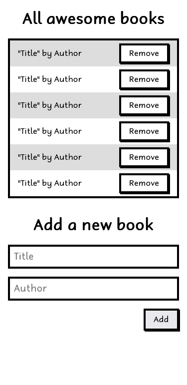

# Awesome books: plain JavaScript with objects

## Overview

In this project, we built a basic website that allows users to add/remove books from a list. This was achieved by using JavaScript objects and arrays, while using javascript DOM and basic events to dynamically modify the page.

## Project Tasks List

- [x] Implement only a basic UI with plain HTML
- [x] Create a collection that keeps a list of books (hint: you can use an array of objects for that).
- [x] Create a function to add a new book to the collection, with title and author.
- [x] Create a function to remove a book from the collection (hint: you can use the array filter() method).
- [x] Display all books saved in the collection in the top part of the page.
- [x] Make sure that when a user clicks the "Add" button:
  - [x] A new book is added to the collection.
  - [x] The new book is displayed in the page.
- [x] Make sure that when a user clicks the "Remove" button:
  - [x] The correct book is removed from the collection.
  - [x] The correct book dissapears from the page.
- [x] Make sure that data is preserved in the browser's memory by using localStorage.
- [x] To debug your application, you can use console.log(). Remember to remove debugging code before pushing your code to the remote repository.

> [Live Demo Link](https://engruugbejimmy.github.io/Awesome_books/)

## Screenshots

<h3 align="center">Screenhot</h3>

  

## Built With

- [HTML](https://developer.mozilla.org/en-US/docs/Web/HTML)
- [CSS](https://developer.mozilla.org/en-US/docs/Web/CSS)
- [JavaScript](https://developer.mozilla.org/en-US/docs/Web/JavaScript)
- [Algorithm Layout](https://every-layout.dev/)

## Getting Started

- Install git bash to your machine to enable you to clone this repo.
- install Visual Studio to be able to host a local live version.
- Install a browser to view the local live version.

To get a local copy up and running follow these simple example steps.

### Prerequisites

- Internet connection
- A github account

### Setup

- Open your GitHub account the repository's [link](https://github.com/EngruugbeJimmy/Awesome_books)

### Install

- copy the repo's link and clone it by writing `git clone https://github.com/EngruugbeJimmy/Awesome_books.git` on your git bash terminal.
- `npm install` to install the dependencies

### Run tests

- You can check for errors by running linter tests found in the github flows.

### Deployment

- Click on 'go live' on your visual studio to view the project live on your local machine.

## Authors

👤 ABAH JAMES

- [GitHub](https://github.com/EngruugbeJimmy)
- [LinkedIn](https://www.linkedin.com/in/abah-james-ugbede-356982159/)

👤 **Engr. Animashaun Fisayo**

- [GitHub](https://github.com/fmanimashaun)
- [Twitter](https://twitter.com/fmanimashaun)
- [LinkedIn](https://www.linkedin.com/in/fmanimashaun/)
- [Website](https://fmanimashaun.com)

👤 **Oscar Deus**

- [GitHub](https://github.com/Oscah01/)
- [Twitter](https://twitter.com/@killer_pip)
- [LinkedIn](https://linkedin.com/in/OscahDeus)

## 🤝 Contributing

Contributions, issues, and feature requests are welcome!

Feel free to check the [issues page](../../issues/).

## Show your support

Give a ⭐️ if you like this project!

## 📝 License

This project is [MIT](./LICENSE) licensed.
